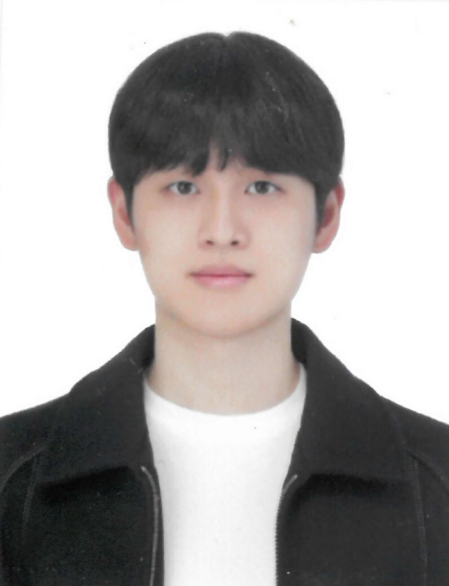

  

  # 이준현 (Lee JoonHyun)

  **AI Engineer** — 모델 학습 · 최적화 · 클라우드 배포

  
  
  

---

## 소개

경력 3년 3개월의 AI Engineer로, 이미지 생성, 얼굴 인식, LLM 서빙, 이상 감지 등 다양한 도메인의 AI 서비스를 설계부터 배포까지 End-to-End로 수행해왔습니다. 특정 기술이나 분야에 국한되기보다, 실제 서비스 환경에서 문제를 해결하고 결과를 만들어내는 데 집중해왔습니다.

특히 비용 절감과 성능 개선처럼 측정 가능한 성과를 만드는 것을 중요하게 생각합니다. AWS SageMaker 비동기 추론 구조를 도입해 서버 비용을 약 50% 절감했으며, 모델 양자화와 Knowledge Distillation을 통해 추론 속도를 약 40% 개선한 경험이 있습니다. 또한 GCP 기반 비동기 LLM 아키텍처를 설계하여 [Chatbook](https://play.google.com/store/apps/details?id=com.joonhyun.chatbook&hl=ko)을 Google Play에 출시했고, 철도차량 공기압축기 이상 감지 연구로 CNN/LSTM Autoencoder 기반 논문 2편을 게재했습니다.

---

## 기술 스택

**AI / ML**

**클라우드 & 인프라**

**모바일 & 기타**

---

## 경력 및 학력

**AI Engineer — (주)퍼포먼스바이티비더블유에이** `2026.03 – 재직 중`
> - 영상 분류 파이프라인 설계 및 구축  
>   (Keyframe 추출 → OCR/STT → Face Detection → Tracking → Embedding → Clustering)
> - 최신 영상 생성 모델(LTX-2, WAN 2.2) 아키텍처 분석 및 적용 검토
> - 광고 데이터 수집 파이프라인 구축 (Bid Data, Postback)
> - 성과 리포트 자동화 시스템 개발

**AI Engineer — 주식회사 애니펜** `2023.04 – 2025.11`
> - 이미지 생성 서비스 개발 및 운영 (Stable Diffusion 기반, AWS 인프라)
> - **서버 비용 50% 절감**  
>   → SageMaker 비동기 추론 구조 도입 (유휴 시 인스턴스 0 유지)
> - **추론 속도 40% 향상**  
>   → 모델 양자화 및 Knowledge Distillation 적용
> - Hair Classification 모델 개발 및 LoRA 자동 평가 파이프라인 구축
> - Face Detection 성능 개선 (NC 다이노스 키오스크 프로젝트)  
>   → EfficientNet 기반 모델 + 데이터 증강 적용

**교육 — Naver BoostCamp AI Tech (CV Track)** `2022.01`
> - 선형대수학 및 Vision AI 알고리즘 학습
> - PyTorch 기반 모델 구현 및 실습
> - 이미지 분류 / 객체 탐지 / 세그멘테이션 프로젝트 수행
> - Ensemble 기법 적용 (MMSegmentation, Hard/Soft Voting)

**학부연구생 — 건국대학교 기계공학과** `2016.03 – 2022.02`
> - Autoencoder 기반 이상 감지 연구 수행 (철도차량 공기압축기)
> - Matlab 기반 부품 상태 시뮬레이션 모델링
> - TensorFlow 기반 Autoencoder 구현 및 Fine-tuning
> - 논문 2편 게재  
>   [철도차량 2단 피스톤 공기압축기 시뮬레이션 연구](https://www.dbpia.co.kr/Journal/articleDetail?nodeId=NODE10584865)  
>   [LSTM/CNN 기반 공기압축기 이상 감지](https://www.dbpia.co.kr/journal/articleDetail?nodeId=NODE10896480)

**인턴 — 에이아이웍스** `2020.08 – 2020.12`
> - 대규모 데이터셋 구축 프로젝트 관리  
>   (CCTV 차량, 수어 손동작, 음원 코드 라벨링)
> - 라벨링 가이드라인 설계 및 품질 관리
> - 작업자 진행 현황 관리 및 생산성 개선

---

## 프로젝트

| 프로젝트 | 설명 | 기술 스택 |
|---------|------|----------|
| [**Chatbook (백엔드)**](https://github.com/JoonHyun814/chatbook_public) | AI 독서 동반자 앱 백엔드 — Cloud Run + GCP Workflow 비동기 LLM 아키텍처. **Google Play 출시.** | GCP · Gemini · Firebase · Python |
| [**Gilog (컴포넌트)**](https://github.com/JoonHyun814/gilog_public) | Flutter 다이어리 앱 — Figma·GitHub Projects 디자이너 협업 + CLAUDE.md AI 협업 규칙 기반 컴포넌트 시스템. | Flutter · Dart · Firebase |
| [**Screw Compressor PHM**](https://github.com/JoonHyun814/Screw_aircompressor_PHM) | 철도차량 공기압축기 이상 감지 — CNN/LSTM Autoencoder. **논문 2편 게재.** | Python · TensorFlow · LSTM · CNN-AE |
| [**Claude Stock**](https://github.com/JoonHyun814/claude_stock) | Claude AI + 커스텀 MCP 서버 기반 장기 가치 투자 포트폴리오 자동 분석 | Python · Claude API · MCP · yfinance |

---

  
  

